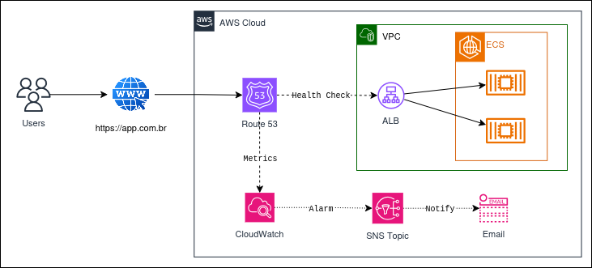

# 🛰️ Monitoramento 24/7 de Aplicação de Gerenciamento de Tarefas na AWS (ECS, Route 53, CloudWatch)

Este projeto foi desenvolvido como parte da **Mentoria Desafio Labs 2.0 – Formação de Arquitetos AWS**, conduzida por **Henrylle Maia**.

O objetivo deste laboratório prático foi implementar uma arquitetura com **monitoramento externo e alta disponibilidade** para uma aplicação containerizada na AWS, garantindo **observabilidade global** e **resposta proativa a falhas**.

---

## 🔍 Visão Geral do Projeto

A aplicação simula um cenário real de produção, utilizando diversos serviços gerenciados da AWS para garantir **resiliência, escalabilidade** e **monitoramento contínuo** com alertas em tempo real.

---

## 🛠️ Tecnologias e Serviços Utilizados

| Serviço                  | Finalidade                                                                  |
|--------------------------|-----------------------------------------------------------------------------|
| Amazon ECS (EC2 Launch)  | Orquestração de containers                                                  |
| Amazon EC2               | Instâncias para execução das tasks do ECS                                   |
| Amazon RDS (MySQL)       | Banco de dados relacional gerenciado                                       |
| Amazon Route 53          | Gerenciamento de DNS e verificação de saúde (Health Checks)                |
| Application Load Balancer| Balanceamento de carga e alta disponibilidade                              |
| Amazon CloudWatch        | Monitoramento, alarmes e visibilidade de métricas                          |
| Amazon SNS               | Notificações automáticas por e-mail e SMS                                  |

---

## 📌 Funcionalidades Implementadas

- ✅ **Monitoramento externo 24/7** por meio de **Health Checks do Route 53**, simulando acessos globais à aplicação.
- ✅ **Alarmes no CloudWatch** configurados para reagir a falhas detectadas nos Health Checks.
- ✅ Integração com **SNS** para envio de notificações em tempo real via **e-mail e SMS**.
- ✅ Utilização do **Application Load Balancer (ALB)** para distribuir o tráfego e manter a disponibilidade da aplicação.
- ✅ Persistência de dados com **Amazon RDS**, mantendo separação entre aplicação e banco.

---

## 🖼️ Diagrama da Arquitetura

---

## 📷 Capturas de Tela

- ``
- ``
- ``
- ``

---

## 🚀 Como Funciona

1. A aplicação é implantada em um **cluster ECS com instâncias EC2**, exposta publicamente via **ALB**.
2. Um **Health Check do Route 53** verifica continuamente a disponibilidade do endpoint público.
3. Um **alarme do CloudWatch** monitora o status do Health Check.
4. Em caso de falha, o alarme dispara uma **notificação via SNS**, enviando alertas para os canais configurados (e-mail/SMS).
5. O ALB mantém o balanceamento de carga e distribui requisições entre as tarefas ativas do ECS.

---

## 📈 Estratégia de Monitoramento

- **Verificação de disponibilidade externa** (sem depender do código da aplicação).
- **Alerta automatizado** com escalonamento instantâneo via SNS.
- **Métricas centralizadas** e monitoramento contínuo via CloudWatch.

---

## 🧠 Aprendizados

- Projetar arquiteturas com foco em **observabilidade e tolerância a falhas**.
- Utilizar **serviços nativos da AWS** para construir ambientes produtivos escaláveis e monitoráveis.
- Integrar **verificação de saúde externa** com automação de alertas para resposta rápida a incidentes.

---

## 📎 Recursos Utilizados

- [Amazon ECS](https://docs.aws.amazon.com/ecs/)
- [Amazon Route 53 – Health Checks](https://docs.aws.amazon.com/Route53/latest/DeveloperGuide/health-checks.html)
- [Amazon CloudWatch – Alarmes](https://docs.aws.amazon.com/AmazonCloudWatch/latest/monitoring/AlarmThatSendsEmail.html)
- [Amazon SNS](https://docs.aws.amazon.com/sns/latest/dg/sns-email-notifications.html)

---

## 👩‍💻 Autora

**Aryane Andrade**  
Cloud Computing • AWS ECS • Monitoramento • Alta Disponibilidade

  

---

